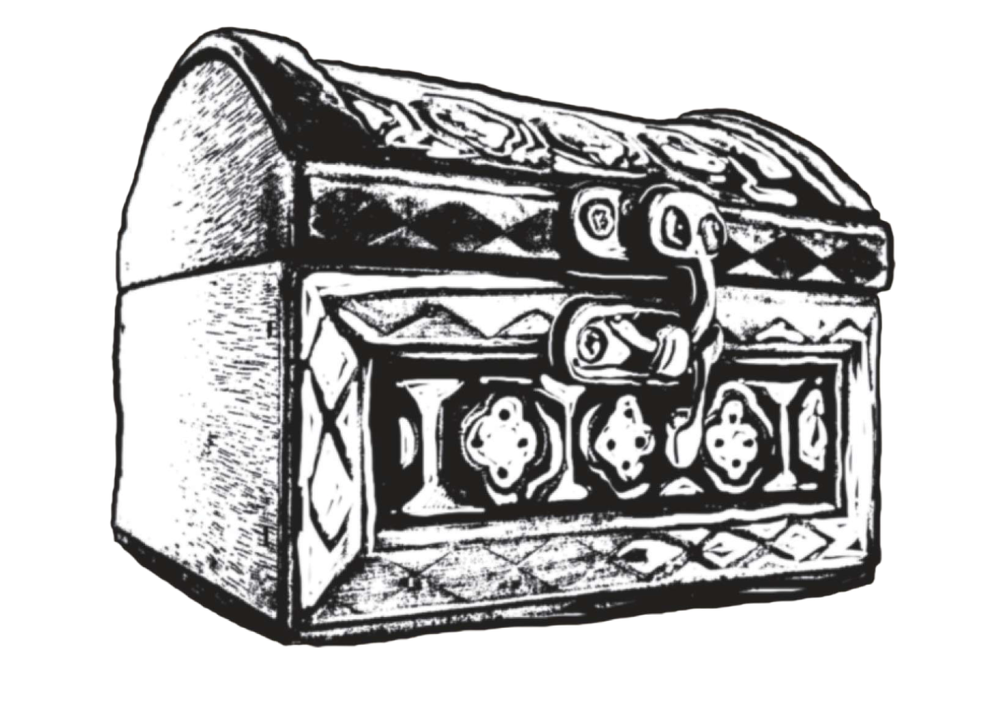

  

# Reznar's Arcane Oddities — take-home

> See `SETUP.md` to get the local Postgres running before you start.

**Checkout a git branch with your name and make incremental pushes. We will follow your commits.**

MulhollandAI has taken on Reznar's Arcane Oddities, a fantasy magic item shop, as a client. Your job is to help Reznar organize their products so that it is easy to add new items for sale and to find patterns across the catalog.

---

## What Reznar can tell you about magic items

"Magic items are strange and mystical things. They come in several grades of rarity, from *common* all the way up to *artifacts*. The most powerful items have to be attuned to their user, and people can only use so many at a time.

A lot of magic items are worn. Rings, amulets, cloaks, gloves, boots, hats, armor, and weapons are all commonly enchanted. Unfortunately, names are not always consistent — something worn on the head might be called a hat, a helmet, or a mask. It's important to distinguish where objects are worn, because people can't use more than one object in each slot.

Reznar is also interested in finding patterns in the magic items, so that he can guide his customers to things that match their needs. He's a little vague on what magic can do, since it can do *anything*, but some dimensions that appear important are offensive improvements, defensive improvements, whether the item is targeted to specific creatures and environments, and whether there are limitations on use."

---

## Part 1 — Ontology & Data Pipeline

Your source data is in `data/items_combined.pdf`. It is messy.

Design an ontology for Reznar's magic item catalog and populate it from the PDF. See `stormland/ontology.py` for a worked example of how an ontology is structured, and `SETUP.md` for how to get the local Postgres running.

**What to produce:**

1. **`reznar/ontology.py`** — your Pydantic entity models. Document your design choices: what entity types you created, what fields you included, and why you structured it the way you did.

2. **An extraction pipeline** — a script or agent that reads the PDF and populates the local Postgres database. The source data is imperfect; your pipeline should handle that gracefully. We are an AI-first company and expect you to build AI tools.

3. **A snapshot** — once your data is loaded, dump it so we can inspect it without rerunning the pipeline. A `pg_dump` or a JSON export of your tables is fine; commit it as e.g. `reznar.dump` or `reznar.json` at the repo root.

---

### Note: What even is an ontology?
Ontology is a philosophy term for 'things that exist', and like all philosophy terms there is a lot of *debate* about it. From a software perspective, ontology is the secret sauce that enables Palantir to be Palantir--a set of structured relationships between everything that can be traversed and queried.
* [Palantir docs](https://www.palantir.com/docs/foundry/ontology/overview)
* [Casey Hart Youtube](https://www.youtube.com/watch?v=UW57RW-4kWs&list=PLIHlyoU28t5_gsMf8EkmnQVSHefbR3xqz)

You can also think of it as a database schema. Formally, an ontology is just a bunch of triples, Subject -> Predicate -> Object, but in practical terms that is a pain to query. There's a lot of pre-existing practice, you may see acronyms  like OWL, BFO, and RDF.

At Mulholland, we move fast, so we build our ontologies in Pydantic. An example codebase is provided.

## Part 2 — Analysis Notebook

Reznar suspects that not all items in his catalog are priced appropriately for their power level. He wants to know if any items look like they don't belong in their rarity tier.

Produce a Jupyter notebook (`analysis.ipynb`) that:

1. **Predicts rarity** from the structured fields you extracted in Part 1. Walk through your feature choices, model selection, and how you evaluate quality given the dataset size.

2. **Identifies rarity anomalies** — items whose characteristics don't match what you'd expect for their stated rarity tier. For each flagged item, explain *why* it stands out.

The notebook should read like a report, not just runnable code. Reznar is not a data scientist; your prose and visualizations should tell the story.

---

## How this assignment will be evaluated

1. **Ontology design** — the quality of your entity model and how well it captures what Reznar described. There is no single right answer; we want to see your reasoning.

2. **Pipeline quality** — how well your extraction handles the messiness of the source data and how completely it captures the catalog.

3. **Notebook clarity** — how legible and insightful your rarity analysis is. Can a non-technical reader follow it?

4. **Explanation** — we want to follow your thought process throughout. Make incremental commits and consider maintaining a timestamped `log.md` as you work.
